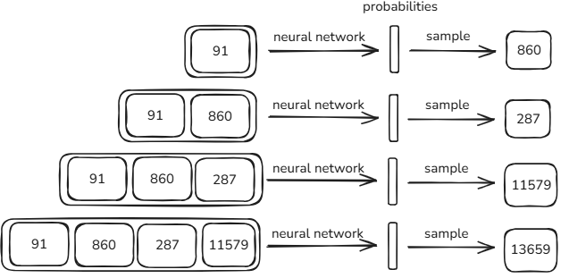

这是对 [Deep Dive into LLMs like ChatGPT]([Deep Dive into LLMs](https://www.youtube.com/watch?v=7xTGNNLPyMI))所做的笔记
### LLM 训练环节
1. Pre-training 预训练
2. Post-training 后训练监督微调 SFT
3. 后训练强化学习

### Pre-training
#### 收集和预处理数据
LLM 的数据集通常非常大，[FineWeb]([FineWeb: decanting the web for the finest text data at scale - a Hugging Face Space by HuggingFaceFW](https://huggingface.co/spaces/HuggingFaceFW/blogpost-fineweb-v1)) 大概有 44TB，起点通常是 common crawl
除此之外还要对数据预处理，过滤一些不合适网站的域名（URL filtering），从 HTML 里抽取正文、去除导航/样式/脚本等（Text extraction）
#### Tokenization
Token 是一种有效减少文本长度的编码，对文本跑 Byte Pair Encoding 得到，大概是迭代合并最常见的 token 对以生成新 token
[查看不同 LLM 的编码方式](https://tiktokenizer.vercel.app/)
因为 LLM 的 IO 单位不是字符而是 token，所以在面对字符串相关问题时幻觉很多（经典 strawberry 有几个 r）
#### 神经网络训练
神经网络的输入是一条一维的 token 序列，处理长窗口在计算上会很昂贵（这也是需要 Tokenize 的一个原因），所以通常会进行裁剪，即为最大的 context length
模型每一步都输出对应维度的分布，表示哪个 token 最可能接下来出现
训练神经网络的过程和一系列更新的过程，可以使得其预测符合你的训练集中实际发生的统计数据，并且其概率变得与数据中 token 相互跟随的统计模式一致（调参）
[神经网络内部结构]([LLM Visualization](https://bbycroft.net/llm))
#### 推理
训练完成的神经网络可以预测下一个 token 出现的概率，生成的 token 会被加入下一轮的推理

!
模型生成的一些参数

- **temperature**：更随机/更保守
- **top-k / top-p（nucleus）**：限制候选 token 集合
- **stop sequences**：遇到就停止
- **repetition penalty**：减少重复
#### 基础模型
训练完后得到了一个基础模型，~~可以发布了~~
发布一个基础模型需要公布跑 Transformer 的代码和其中的参数
**基础模型具有以下特征**
- 模型学会在 token 序列上续写，且生成文本像互联网上的文档
- 每次运行都会生成不同的内容
- 可以从记忆中逐字复述训练文档，但无法一直复述
- 模型参数可以被认为是互联网的有损压缩，参数中存储了大量有用的世界知识
- 即使只是 base model，在 prompt 里把任务伪装成熟悉的文本形态使它完成部分任务
    例如构建 few-shot 提示并利用上下文学习能力实现翻译
    例如设计对话式提示词的智能助手来回答问题

### Post-training
### Supervised Fine-tuning(SFT) 监督式微调
会给模型查看大量的助手式文本，使得模型更像一个助手。
另外模型强到一定程度后，会反过来参与数据生成和评测
训练完成后，得到的就是常见的一些模型

### LLM 心理学特征
**Hallucinations 幻觉** 知道了 LLM 是概率学模型，就不难理解幻觉为什么会产生
如何降低幻觉呢
- 通过大量询问确定模型的知识边界（同一个问题问很多遍得到不一样的回答说明大模型不知道这个问题），然后我们将这些问题的正确答案设置为“不知道”
- 让模型去搜索，将网络里参数的 vague recollection 转换为上下文中的 working memory
**自我意识**
LLM 没有自我意志，让它回答“我是谁？”这一类的问题需要用系统提示词或者专门的数据
**模型使用 token 思考**
模型每输出一个 token 可以被看做一次前向传播，有一定计算力但不多
所以中间步骤就相当于花费 token 帮助思考
如下图，由于 LLM 是一个一个 token 输出的，所以左边的输出相当于鼓励 LLM 在一个 token 里算出答案，而右边的输出鼓励模型按照步骤思考

### Reinforcement Learning
如果类比书本的学习，pre-training 是课本上概念的讲解，STF 是例题，而 RL 是课后习题
训练大概是：用不同的 prompt, 每一个 prompt 生成许多次回答，鼓励那些生成正确答案几率更高的 prompt 加入训练，这样模型正在自己发现什么样的 token sequences 会引导它得出正确答案

### Reinforcement Learning with Human Feedback (RLHF)
对于一些无法验证的领域（如创意），需要少量人类介入
- 对同一 prompt 采样多个回答（rollouts）
- 让人类做**排序**（比打分更容易）
- 训练一个单独的 **Reward Model** 去拟合这种偏好排序，然后再用 RL 让语言模型最大化 reward
RLHF 只能微调，跑太久可能会欺骗奖励模型
