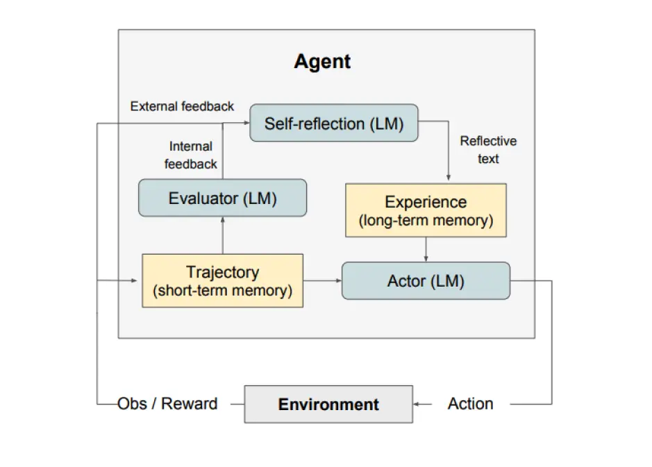

## 一般性建议
这部分笔记来自于 Anthropic 的圆桌会议的内容
提示工程的工程感来自于可重置可迭代可优化，这对于优秀的提示词构建是必须的
具体性、简单性和简洁性通常有更好的结果
包含过多不必要的细节不一定是一种好的方法。细节应与任务相关，并有助于当前任务。
尽可能精确的描述指令，比如不用数量约词而是范围

尝试把模型当作一个**很聪明、懂行业常识、但不了解你公司上下文的临时工**。你需要把背景、目标、边界情况、出错怎么办讲清楚

### 提示词工程师素养
一个优秀的提示词工程师应该可以：
- 清晰表达与概念拆解能力
- 强迭代意愿
- 边界/异常输入思维（在面向企业时更明显，因为用户会有很多抽象输入）
- 阅读模型输出，评判模型输出能力
- 把你脑中知道但模型不知道的写出来。现阶段模型不会像人一样主动追问澄清（Alex也提到这一点），所以工程师要在 prompt 里预先补齐

### 提示词设计工作流
一套理想的提示词设计工作如下：
1. 让模型做需求审查
	给出初稿 prompt 后，先让模型**不要执行任务**，而是指出指令里哪里不清晰、有歧义、缺信息
2. 当模型做错时，直接追问“为什么错/如何改”
3. 把“边界处理”写进 prompt
	如果输入完全不符合任务（比如给了山羊图片却要它分析图表），模型会“硬做”，因此应该在 prompt 里明确：遇到异常/不确定时输出带标签的 **unsure**，便于后续集中复查
4. 评估与测试要像做工程一样严谨
	当 ai 得到多次一致性高的结果才考虑信任模型；
	查看 ai 的思维过程。而不是只看结果
5. 把 prompt 当代码资产管理

### 提示词实践建议
- Zack：多读高质量 prompt 与输出，做拆解式学习，尝试了解一个部分如何优化模型
- Amanda：让不懂背景的人读你的 prompt 找盲点；多练、保持兴趣；用新手视角审视；做对抗性测试
- David：别只做“写邮件”这类简单任务；要做看似不可能的任务、做 agent/任务分解，在失败中理解模型边界

## 提示词技巧

#### Zero-Shot Prompting
现代的 LLM 经历大规模训练，直接指示模型执行任务，而无需任何额外引导示例的方法在部分任务上表现不赖。当零样本方法不起作用时，建议在提示中提供演示或示例，即少样本提示
#### Few-Shot Prompting
示例即 shot，关于少样本提示词中一些建议（来自 Min et al. (2022) 的论文*Rethinking the Role of Demonstrations: What Makes In-Context Learning Work?* ）
- 示例中的 **标签空间（Label Space）** 和 **输入文本的分布** 是最重要的，哪怕给的示例里标签完全填错了，模型依然能表现得很好
	**标签空间（Label Space）：** 比如做情感分类任务，标签是“正面/负面”。只要在示例里展示了这两个词，告诉模型“答案只能从这两个词里选”，这就够了。
	**标签正确性不重要：** 哪怕示例写的是错的（例如：“这部电影太好看了 -> 负面”），只要格式对，模型依然能学会“这是一个分类任务，我要输出正面或负面”。因为模型不是真的在从这几个例子里“学习”逻辑，而是在利用这些例子来定位任务
- 提示词的**格式**本身就起到了关键作用。即使你在示例里随机瞎填标签，效果也比完全不给示例要好得多
- 如果要瞎填标签（随机标签），最好也按照**真实答案的分布比例**来填，而不是均匀地填
	符合真实概率的随机标签比 50% / 50% 的均匀分布效果更好
	暗示了模型关于答案的先验概率
#### Chain-of-Thought(CoT) Prompting
思维链通过提供中间步骤实现更为复杂的推理能力
可以和样本提示词结合到一起使用
**Zero-Shot CoT Prompting**
核心是添加 “Let's think step by step”，在部分任务中效果显著
**Automatic Chain-of-Thought**
用“零样本”的方法，自动生成“少样本”所需的示例
Auto-CoT 注重多样性，将问题向量化后聚类，从每个簇中选择代表性问题，使得示例涵盖不同的问题范式，随后利用 LLM 本身的能力，使用零样本提示词回答这些代表性问题，将模型生成的输出作为标准答案，随后自动组合形成完整的 few-shot prompt，指导新的用户提问
[自动化代码]([amazon-science/auto-cot: Official implementation for "Automatic Chain of Thought Prompting in Large Language Models" (stay tuned & more will be updated)](https://github.com/amazon-science/auto-cot))

#### Meta Prompt
元提示是一种关注任务和问题的结构和句法方面，而不是其具体内容细节高级提示技术。目标是构建一种更抽象、更有结构的方式与 LLMs 交互，强调信息的形式和模式，而非传统的以内容为中心的方法。

元提示词的性质
1. 优先关心“问题与答案的组织方式”，而非具体内容
2. 强调并把句法 (Syntax) 作为预期响应的模板
	这里句法也包括提示词的形式化写法：例如 YAML/JSON 风格、`Input/Output` 块、`Step 1/2/3`、`Constraints`
	例子
```markdown
用以下格式输出：
- **Goal:** …    
- **Assumptions:** …
- **Steps:** 1)… 2)…
- **Risks & Mitigations:** …”
```
3. 用抽象的示例展示结构，展示问题和解决方案的结构，而不关注具体细节
	因为我们希望让模型学会这类问题的解决方案，而不是记住某个具体样例
4. 可复用性强，这个是元提示词本身决定的

需要注意的是，元提示法还假设 LLM 对所处理的特定任务或问题具有先验知识。由于 LLM 可以泛化到未见过的任务，因此它们有可能通过元提示法得到利用，但在更独特和新颖的任务上，性能可能会像零样本提示法那样下降

#### Self-Consistency
Self-consistency 通过生成多个不同 reasoning 路径并进行比较，然后选出最稳定、最一致的结果作为最终答案
应该是利用模型自身多样输出来过滤噪音
实现 self-consistency 的方法很多，可以在一次对话中让模型使用不同策略；使用相同提示词寻找占比大的答案

#### Generated Knowledge Prompting
Generated Knowledge Prompting 是一种高级提示工程方法，它不是直接让模型回答问题，而是先让模型生成与问题相关的知识/事实，再利用这些生成的知识来回答原问题

生成知识提示能帮助模型建立起与问题相关的逻辑或事实背景，从而减少回答错误。特别是常识类或需要多步逻辑的信息推理任务。LLM 在面对某些细节不充足的问题时可能会“猜答案”或者因上下文不足而答错。通过先生成知识，这部分风险可以被缓冲。对于需要背景信息或多个概念组合的问题，先生成知识能提升逻辑连贯性。

感觉是一种另类的 CoT

#### Prompt Chain
将一个复杂任务分解成一系列小任务，让模型逐步完成。每一步的输出结果会被传递给下一步的提示，形成一个链状流程
其实是类分治的方式简化问题
- 将原始的复杂问题拆成多个逻辑上独立的小步骤
- 为每个步骤单独设计一个提示（Prompt）
- 让模型按顺序完成这些提示，每一步输出作为下一步输入
- 最终得到一个整体正确、清晰的结果

#### Reflexion
Reflexion 是一种让 LLM 具备从过去行为中反思并改进自己表现的能力的提示技术框架


由上图可知，reflexion 由三个模型构成

- Actor: 执行当前任务，生成**轨迹（trajectory）** ，比如在决策、编程或推理中每一步的输出与观察。可以使用 ReAct 和 CoT 
- Evaluator: 另一个模型对 Actor 的输出进行评分，这个模型将轨迹作为输入并输出一个奖励分数（根据任务不同使用不同的奖励函数）
- Self-reflection: 生成强化提示帮助 Actor 自我改进。Self-reflection model 使用奖励信号（external feedback），当前轨迹及其持久记忆（internal feedback） 生成具体且相关的反馈。这些经验存入长期记忆用于改进决策

reflexion 适用于以下情况：agent 需要通过试错学习的，由于客观条件难以应用强化学习的，需要细致反馈的。比如编程，推理。

#### ReAct 和 ART (Action-Reasoning-Thinking)
ReAct 其实是 Reason + Act，即将推理和行动结合，具体地
- 接收用户输入
- 模型写出一个 **Thought**
- 如果需要动作 → 生成一个 **Action**
- 由系统/工具执行，产生 **Observation**
- Observation 回写到对话
- 模型基于新的信息继续生成 Thought
- 重复直到完成并输出回答
ART 和 ReAct 的区别在于存在会将外部反馈纳入推理，能够动态调整策略，这里的动态调整策略只会不会修改做事的方式，ReAct 默认策略是正确的且不会修改

#### Retrieval-Augmented Generation (RAG)
模型参数里的隐式知识效果小于上下文知识，所以模型输出更准确
RAG 分为 Retriever 和 Generator
- Retriever 负责从知识库（如文档库、向量数据库、网页内容）中找出最相关的信息片段，使用向量搜索，布尔关键词搜索等
- Generator 将检索到的文档片段 + 用户问题组合成 Prompt，让 LLM 综合信息回答